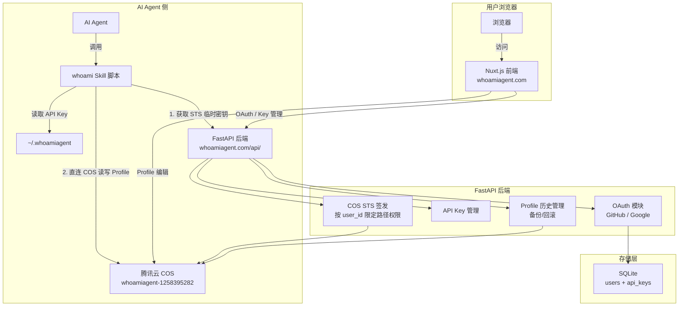

## 产品概述

whoami 是一个跨 AI 用户身份档案同步服务。用户维护一份"身份档案（Profile）"，任何 AI Agent 在对话时都能通过 whoami Skill 拉取这份档案，快速"认识"用户，无需重复自我介绍。

Phase 1 MVP 范围：更新 plan.md、搭建 FastAPI 后端 + Nuxt.js 前端 + 更新 Skill 脚本远端化 + 编写 README.md。

## 核心功能

### 1. 更新 plan.md 和项目规范

- 更新 plan.md 反映全部技术和产品变更（先 Skill 后 MCP、域名、OAuth、目录结构、COS STS 方案等）
- 编写 `.codebuddy/rules/project-rule.mdc` 项目开发规范

### 2. FastAPI 后端（./backend）

- GitHub OAuth / Google OAuth 登录注册
- API Key 生成与管理（`wai_` 前缀，hash 存储，一个用户可多个 Key）
- Profile 操作简化为 get（获取 COS STS 临时密钥 + profile 路径）和 update（POST 覆盖写入，先备份历史）
- 每用户保留最近 3 份历史 profile，支持列出历史和回滚
- COS STS 临时密钥接口，调用方直连 COS 获取/上传文件
- COS 桶 `whoamiagent-1258395282`，区域 `ap-hongkong`

### 3. Nuxt.js 前端（./frontend，whoamiagent.com）

- **Home Page**：产品介绍、SVG 动画展示使用流程和项目特点、安装方法（`npx skills add MorvanZhou/whoami`）、可复制 Agent 引导 prompt
- **Login Page**：GitHub/Google OAuth 按钮，支持 `?for=apikey` 参数
- **Dashboard**：API Key 展示 + Copy 按钮 + 引导 prompt
- 多语言支持 en（默认）和 zh
- 前后端同域：前端 `https://whoamiagent.com`，后端 `https://whoamiagent.com/api/`

### 4. Skill 脚本远端化（./skills/whoami/）

- 更新 `whoami_profile.py`：get/update 通过获取 COS STS 临时密钥后直连 COS 操作 profile
- API Key 从 `~/.whoamiagent` 配置文件读取（跨平台兼容）
- 更新 SKILL.md 和 references 文档

### 5. README.md

- 项目完成后编写，只介绍 Skill 功能和使用方法

## 技术栈

| 层级 | 技术 | 说明 |
| --- | --- | --- |
| 后端框架 | FastAPI (Python 3.12) | 异步高性能，自带 OpenAPI 文档 |
| 依赖管理 | uv | 现代 Python 包管理器，替代 pip/poetry |
| 数据库 | SQLite + SQLAlchemy 2.0 (async) | 配合 aiosqlite 异步驱动，WAL 模式 |
| OAuth 库 | authlib + httpx | 成熟的 OAuth2 实现 |
| JWT | python-jose + passlib | Token 签发和验证 |
| COS SDK | cos-python-sdk-v5 | 腾讯云 COS 操作（包括 STS 临时密钥生成） |
| COS STS | qcloud-python-sts | 腾讯云 STS SDK 生成临时密钥 |
| 缓存 | cachetools | Profile 读取 TTL 缓存 |
| 前端框架 | Nuxt.js 3 + Vue 3 + TypeScript | SSR/SSG、SEO 友好 |
| 前端样式 | Tailwind CSS 4 | 实用优先 CSS |
| 多语言 | @nuxtjs/i18n | 官方 i18n 模块 |
| 域名 | whoamiagent.com | 前后端同域 |
| 部署 | 腾讯云 CVM + Nginx | 反向代理 `/api/` 到 FastAPI |


## 实现方案

### 整体架构

前后端同域部署，Nginx 将 `/api/` 反向代理到 FastAPI 后端，其余请求由 Nuxt.js 前端处理。Skill 脚本通过 COS STS 临时密钥直连 COS 读写 Profile，避免后端做文件代理。



### COS STS 临时密钥方案

核心思路：后端不代理 COS 文件读写，而是签发限定路径权限的 STS 临时密钥，调用方（Skill 脚本 / 前端）拿到临时密钥后直连 COS。

- STS 临时密钥通过 `qcloud-python-sts` 生成，有效期 1800 秒
- 权径限定为 `profiles/{user_id}/*`，确保用户只能访问自己的文件
- COS 桶：`whoamiagent-1258395282`，区域：`ap-hongkong`

COS 存储结构：

```
cos://whoamiagent-1258395282/
└── profiles/
    └── {user_id}/
        ├── current.md                        # 当前 profile
        └── history/
            ├── 20260302T120000Z.md           # 历史版本（ISO 时间戳）
            ├── 20260301T150000Z.md
            └── 20260228T090000Z.md           # 最多保留 3 份
```

### Profile 操作设计

简化为两种核心操作：

1. **get**：获取 STS 临时密钥 + COS 路径信息，调用方直连 COS 下载 `current.md`
2. **update (POST overwrite)**：

- 后端先将 `current.md` 复制到 `history/{timestamp}.md`
- 将新内容写入 `current.md`
- 清理超过 3 份的历史版本（按时间排序，删除最旧的）
- 返回成功状态

### 数据库设计

```sql
CREATE TABLE users (
    id            TEXT PRIMARY KEY,           -- UUID
    email         TEXT,
    name          TEXT,
    avatar_url    TEXT,
    provider      TEXT NOT NULL,              -- "github" / "google"
    provider_id   TEXT NOT NULL,
    created_at    DATETIME DEFAULT CURRENT_TIMESTAMP,
    is_active     BOOLEAN DEFAULT TRUE,
    UNIQUE(provider, provider_id)
);

CREATE TABLE api_keys (
    id          TEXT PRIMARY KEY,             -- UUID
    user_id     TEXT REFERENCES users(id),
    key_hash    TEXT UNIQUE NOT NULL,         -- SHA256 hash
    key_prefix  TEXT NOT NULL,               -- "wai_xxxx" 前缀展示
    label       TEXT,
    created_at  DATETIME DEFAULT CURRENT_TIMESTAMP,
    last_used   DATETIME,
    is_active   BOOLEAN DEFAULT TRUE
);
```

### API 接口设计（RESTful，/api/ 前缀）

```
# OAuth 认证
GET  /api/auth/github/login          # 跳转 GitHub OAuth（query: ?for=apikey）
GET  /api/auth/github/callback       # GitHub OAuth 回调
GET  /api/auth/google/login          # 跳转 Google OAuth
GET  /api/auth/google/callback       # Google OAuth 回调
GET  /api/auth/me                    # 获取当前用户信息（JWT 鉴权）
POST /api/auth/logout                # 登出

# API Key 管理（JWT 鉴权）
POST   /api/keys                     # 创建 API Key（返回一次明文）
GET    /api/keys                     # 列出用户所有 Key（仅前缀）
DELETE /api/keys/{id}                # 撤销 Key

# COS 临时密钥（API Key Bearer 鉴权）
GET    /api/cos/sts                  # 获取 COS STS 临时密钥 + profile 路径

# Profile 操作（API Key Bearer 鉴权）
GET    /api/profile                  # 获取当前 profile 内容（后端代理读取 COS current.md）
POST   /api/profile                  # 覆盖更新 profile（先备份历史，再写入 current.md）
GET    /api/profile/history          # 列出历史版本（时间戳列表）
POST   /api/profile/rollback/{ts}   # 回滚到某个历史版本
```

> 说明：虽然有 STS 直连方案，但 GET/POST /api/profile 也提供后端代理模式，供 Skill 脚本简单调用。Skill 脚本可以选择直连 COS（更快）或通过后端代理（更简单）。

### OAuth 流程

1. 前端跳转到 `/api/auth/{provider}/login`（带 `?for=apikey` state 参数）
2. 后端生成 OAuth state，重定向到 GitHub/Google 授权页
3. 用户授权后回调到 `/api/auth/{provider}/callback`
4. 后端验证 OAuth code，获取用户信息，查找或创建用户，签发 JWT
5. 通过 URL fragment 或 cookie 将 JWT 传回前端，前端根据 `for` 参数跳转

### Skill 脚本远端化设计

`whoami_profile.py` 重写为远端 API 调用：

- **配置读取**：从 `~/.whoamiagent` 读取 `WHOAMI_API_KEY` 和 `WHOAMI_ENDPOINT`
- **get 命令**：`GET /api/profile`，Bearer Token 鉴权，输出 profile 内容
- **update 命令**：`POST /api/profile`，覆盖写入
- **setup 命令（新增）**：交互式写入 API Key 到 `~/.whoamiagent`
- **降级策略**：未配置 API Key 时，输出友好提示引导用户前往 `whoamiagent.com` 注册
- 仅使用 Python 标准库（`urllib.request`），零第三方依赖

### 跨平台配置路径

`~/.whoamiagent` 文件：

```
WHOAMI_API_KEY=wai_xxxxxxxxxxxxxxxx
WHOAMI_ENDPOINT=https://whoamiagent.com
```

- Python 使用 `Path.home() / ".whoamiagent"` 实现跨平台（macOS/Linux/Windows）

## 实现注意事项

### 性能

- FastAPI 全异步，SQLite WAL 模式支持并发读
- Profile GET 高频操作，后端可加 TTL 内存缓存（cachetools，60 秒 TTL）
- COS STS 临时密钥缓存：同一用户短时间内多次请求复用同一密钥（有效期内）

### 安全

- API Key 明文不入库，仅存 SHA256 hash；生成时返回一次明文
- API Key 前缀 `wai_` + 前 4 位用于用户辨识
- OAuth state 参数防 CSRF
- JWT 7 天过期，HttpOnly cookie 传递
- COS STS 路径限定 `profiles/{user_id}/*`，用户间数据隔离
- CORS 仅允许 `whoamiagent.com`

### 向后兼容

- Skill 脚本移除本地 fallback（远端优先设计，未配置则引导注册）
- 本地 `~/.whoami_profile` 不再使用，引导用户迁移到远端

### 日志

- 后端使用 Python logging，格式 `[whoami] {level} {message}`
- 关键操作（OAuth 登录、API Key 创建/撤销、Profile 写入/回滚）记录 INFO 日志

## 目录结构

本次实现涉及更新现有文件和创建全新的后端/前端工程。

```
whoami/
├── plan.md                                      # [MODIFY] 更新为 Phase 1 MVP 实施计划
├── README.md                                    # [NEW] Skill 使用说明（最后编写）
├── .codebuddy/rules/
│   └── project-rule.mdc                         # [MODIFY] 编写代码风格和项目开发规范
│
├── backend/                                     # [NEW] FastAPI 后端工程
│   ├── pyproject.toml                           # [NEW] uv 项目配置，Python 3.12 依赖声明
│   ├── .env.example                             # [NEW] 环境变量模板（OAuth、COS、JWT 等配置）
│   ├── app/
│   │   ├── __init__.py
│   │   ├── main.py                              # [NEW] FastAPI 入口：挂载路由、CORS、lifespan 初始化 DB
│   │   ├── config.py                            # [NEW] pydantic-settings 配置类（读 .env）
│   │   ├── database.py                          # [NEW] SQLAlchemy async engine + session maker + init_db
│   │   ├── models/
│   │   │   ├── __init__.py
│   │   │   ├── user.py                          # [NEW] User ORM 模型（OAuth provider 字段）
│   │   │   └── api_key.py                       # [NEW] ApiKey ORM 模型（hash 存储、prefix 展示）
│   │   ├── routers/
│   │   │   ├── __init__.py
│   │   │   ├── auth.py                          # [NEW] OAuth 路由（GitHub/Google login+callback、me、logout）
│   │   │   ├── keys.py                          # [NEW] API Key CRUD（JWT 鉴权）
│   │   │   ├── profile.py                       # [NEW] Profile get/update/history/rollback（API Key Bearer 鉴权）
│   │   │   └── cos.py                           # [NEW] COS STS 临时密钥签发接口
│   │   ├── services/
│   │   │   ├── __init__.py
│   │   │   ├── auth_service.py                  # [NEW] OAuth token 交换、用户查找/创建、JWT 签发/验证
│   │   │   ├── key_service.py                   # [NEW] API Key 生成（wai_前缀 + secrets）、hash、验证、CRUD
│   │   │   ├── cos_service.py                   # [NEW] COS 操作封装：读写 profile、备份历史、清理旧版本
│   │   │   └── sts_service.py                   # [NEW] COS STS 临时密钥生成（qcloud-python-sts）
│   │   └── deps.py                              # [NEW] 依赖注入：get_db、get_current_user(JWT)、get_user_by_apikey(Bearer)
│   │
│   └── alembic/ (可选，Phase 1 暂用 create_all)
│
├── frontend/                                    # [NEW] Nuxt.js 3 前端工程
│   ├── nuxt.config.ts                           # [NEW] Nuxt 配置（i18n、tailwind、API proxy /api/ → backend）
│   ├── package.json                             # [NEW] 前端依赖
│   ├── tailwind.config.ts                       # [NEW] Tailwind 深色主题定制
│   ├── app.vue                                  # [NEW] 根组件
│   ├── locales/
│   │   ├── en.json                              # [NEW] 英文语言包
│   │   └── zh.json                              # [NEW] 中文语言包
│   ├── layouts/
│   │   └── default.vue                          # [NEW] 默认布局（导航栏 + footer + slot）
│   ├── pages/
│   │   ├── index.vue                            # [NEW] Home Page（Hero + SVG 动画 + 特色 + 安装引导 + prompt）
│   │   ├── login.vue                            # [NEW] Login Page（OAuth 按钮，支持 ?for=apikey）
│   │   ├── auth/
│   │   │   └── callback.vue                     # [NEW] OAuth Callback 处理页（存 JWT、跳转）
│   │   └── dashboard.vue                        # [NEW] Dashboard（API Key 展示 + prompt 引导）
│   ├── composables/
│   │   ├── useAuth.ts                           # [NEW] 认证状态管理（JWT token、user info）
│   │   └── useApi.ts                            # [NEW] API 调用封装（$fetch + Bearer header）
│   ├── components/
│   │   ├── home/
│   │   │   ├── HeroSection.vue                  # [NEW] Hero 区域（标题 + CTA）
│   │   │   ├── FlowAnimation.vue                # [NEW] SVG 动画：展示 Skill 使用流程
│   │   │   ├── FeaturesSection.vue              # [NEW] 产品特色三列卡片
│   │   │   └── InstallGuide.vue                 # [NEW] 安装命令 + Agent prompt 引导区
│   │   ├── CopyBlock.vue                        # [NEW] 通用可复制文本块组件
│   │   ├── OAuthButtons.vue                     # [NEW] GitHub/Google OAuth 登录按钮组
│   │   ├── LanguageSwitcher.vue                 # [NEW] 语言切换 EN/ZH toggle
│   │   └── ApiKeyCard.vue                       # [NEW] API Key 展示卡片（含 Copy + prompt 引导）
│   └── middleware/
│       └── auth.ts                              # [NEW] 路由守卫（Dashboard 需登录）
│
└── skills/whoami/
    ├── SKILL.md                                 # [MODIFY] 更新为远端 API 调用方式，get/update 命令
    ├── scripts/
    │   └── whoami_profile.py                    # [MODIFY] 重写为 HTTP API 调用远端服务，支持 setup/get/update
    └── references/
        └── profile_format.md                    # [MODIFY] 更新存储位置为远端 COS，更新 API 说明
```

## 关键数据结构

```python
# backend/app/config.py
class Settings(BaseSettings):
    # Database
    database_url: str = "sqlite+aiosqlite:///./whoami.db"

    # JWT
    jwt_secret: str
    jwt_algorithm: str = "HS256"
    jwt_expire_days: int = 7

    # GitHub OAuth
    github_client_id: str
    github_client_secret: str
    github_redirect_uri: str = "https://whoamiagent.com/api/auth/github/callback"

    # Google OAuth
    google_client_id: str
    google_client_secret: str
    google_redirect_uri: str = "https://whoamiagent.com/api/auth/google/callback"

    # COS
    cos_secret_id: str
    cos_secret_key: str
    cos_region: str = "ap-hongkong"
    cos_bucket: str = "whoamiagent-1258395282"

    # General
    frontend_url: str = "https://whoamiagent.com"
    api_key_prefix: str = "wai_"

    model_config = SettingsConfigDict(env_file=".env")
```

```python
# Skill 脚本 ~/.whoamiagent 配置格式
# WHOAMI_API_KEY=wai_xxxxxxxxxxxxxxxx
# WHOAMI_ENDPOINT=https://whoamiagent.com
```

## 设计风格

深色极客风 + 终端美学，灵感来自 VS Code / GitHub 暗色主题。以深邃的藏蓝-墨色背景为主基调，搭配紫蓝渐变光效强调核心操作区域。布局简洁、留白充足、内容优先。终端风格代码展示区域使用等宽字体，配合微妙的 glow 效果营造科技感。

交互层面采用流畅的 hover 过渡、按钮渐变光效和微动画。SVG 动画使用线条流动和节点连接的方式展示数据同步流程，赋予页面"呼吸感"和动态生命力。

整体使用 Nuxt.js 3 + Vue 3 + Tailwind CSS 4 实现，`@nuxtjs/i18n` 处理多语言（en 默认 / zh），URL 前缀策略。

## 页面设计

### Page 1: Home Page (`/`)

**Block 1 - 顶部导航栏**
深色半透明固定导航栏。左侧 whoami logo 使用终端风格 `$_whoami`，右侧语言切换 toggle（EN/ZH）和 "Get Started" 渐变发光按钮。滚动时增加 backdrop-blur 模糊效果。

**Block 2 - Hero 区域**
页面中心大标题 "Let every AI know who you are"，下方一行副标题说明产品核心价值。底部一个紫蓝渐变发光 CTA 按钮 "Get Your API Key"。背景使用 CSS 网格光点动画和微妙粒子流动效果。

**Block 3 - SVG 流程动画**
全宽区域展示 SVG 动画。通过线条流动和节点连接，依次展示：(1) 用户安装 Skill (2) AI Agent 读取 Profile (3) 跨 AI 同步共享。动画使用 CSS/SVG animation + Vue transition 实现，节点出现时带缩放弹入效果，连线带流光动画。

**Block 4 - 产品特色**
三列卡片布局展示核心特色：(1) Cross-AI Sync 跨 AI 同步 (2) Privacy First 隐私优先 (3) Developer Friendly 开发者友好。卡片深色毛玻璃背景，hover 时边框渐变发光，图标使用内联 SVG。

**Block 5 - 安装引导**
分两个区域：上方深色代码块展示 `npx skills add MorvanZhou/whoami`，带 Copy 按钮和复制成功反馈。下方"Agent Auto-Setup Prompt"区域，终端风格文本块展示可复制 prompt，引导用户粘贴给 AI Agent 自动安装注册。

**Block 6 - Footer**
简洁深色 footer，居中布局：GitHub 仓库链接、文档链接、版权信息。

### Page 2: Login Page (`/login`)

**Block 1 - 顶部导航栏**
与 Home Page 一致的导航栏。

**Block 2 - 登录卡片**
页面垂直居中的登录卡片，深色毛玻璃背景，圆角阴影。顶部 whoami logo，下方两个 OAuth 按钮堆叠排列：GitHub 登录（深色按钮 + GitHub SVG 图标）和 Google 登录（白色按钮 + Google SVG 图标）。底部小字提示"登录后即可获取 API Key"。

**Block 3 - 背景**
与 Home Page 一致的网格光点背景，营造沉浸感。

### Page 3: Dashboard (`/dashboard`)

**Block 1 - 顶部导航栏**
登录态导航栏。右侧显示用户头像和名称，点击弹出下拉菜单含 Logout 选项。

**Block 2 - API Key 区域**
标题 "Your API Key"，大字体展示 API Key（等宽字体），右侧 Copy 按钮，复制后显示绿色 "Copied!" 动画反馈。下方卡片列表展示所有 Key（前缀、标签、创建时间、操作按钮）。

**Block 3 - Agent 配置引导 Prompt**
终端风格深色代码块，展示可复制 prompt 文本："已成功获得 whoami 的 apikey，现在你可以将这段 apikey 保存到 ~/.whoamiagent..."。带 Copy 按钮和成功反馈。

**Block 4 - 快速开始提示**
图文说明下一步操作：将 prompt 粘贴给 AI Agent 即可完成配置。

## Agent Extensions

### Skill

- **frontend-design**
- Purpose: 设计和实现 whoami 前端所有页面（Home Page 含 SVG 动画、Login Page、Dashboard），确保深色科技风高质量 UI
- Expected outcome: 生成完整 Nuxt.js 页面组件代码，包含响应式布局、多语言、SVG 流程动画、Copy 交互、OAuth 按钮等

- **skill-creator**
- Purpose: 更新 whoami Skill 的 SKILL.md、scripts 和 references，确保符合 skills.sh 平台规范
- Expected outcome: 生成符合规范的 SKILL.md 和更新后的远端化脚本（get/update 命令）

### SubAgent

- **code-explorer**
- Purpose: 在实现各模块时探索项目结构和现有代码，确保代码风格一致性
- Expected outcome: 精确定位修改目标，确认已有文件内容和依赖关系