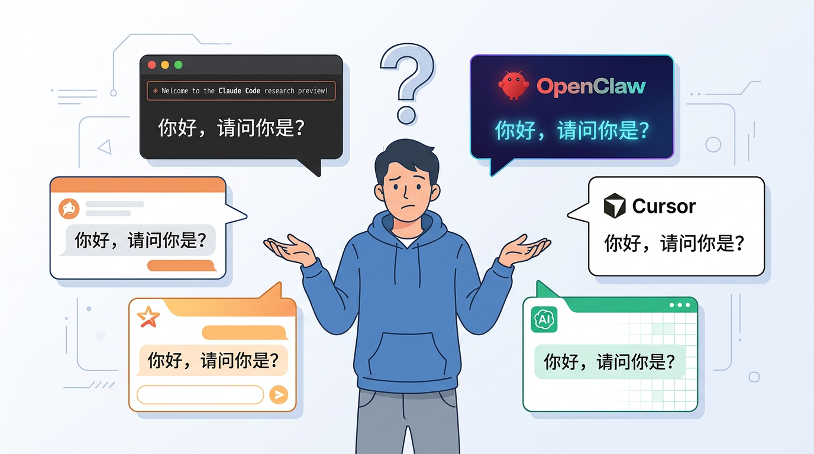
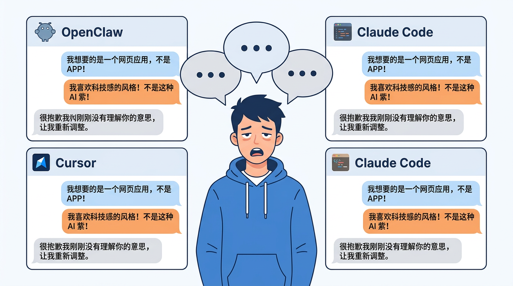
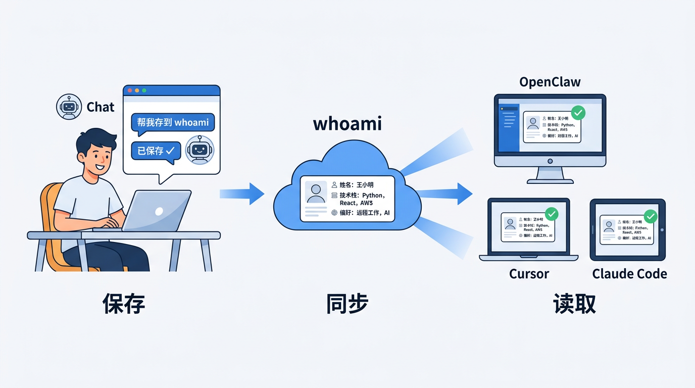
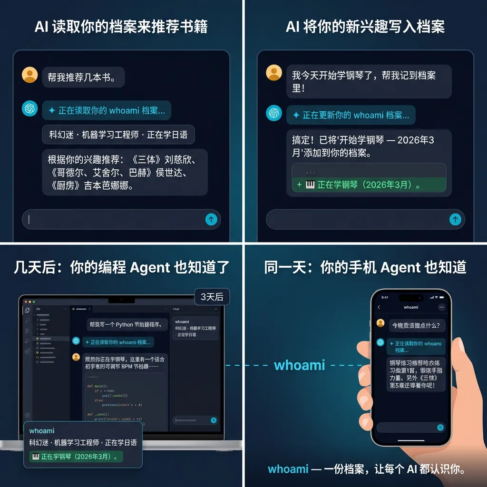

# AI 记住了全世界，唯独记不住你

<!-- AI 生图 prompt: 画面中央一个二十多岁的年轻人站在中间，表情无奈地摊开双手。他的周围漂浮着五个不同品牌风格的AI聊天窗口：一个带有橙色爪印图标的窗口代表OpenClaw，一个带有紫色光标箭头图标的窗口代表Cursor，一个带有橙褐色圆形图标的窗口代表Claude Code，还有两个其他风格的AI聊天窗口。每个窗口里都显示着同一句话："你好，请问你是？"。年轻人头顶有一个巨大的问号。背景是简洁的浅灰白色。扁平化现代插画风格。色调以科技蓝、浅灰白为主，搭配少量暖橙做点缀。整体氛围轻松、有亲和力、充满科技感。 -->

---

你有没有过这种经历——

在 OpenClaw 里跟 AI 聊了一个小时，项目背景讲清楚了，技术栈对齐了，代码风格也统一了。聊得很开心，觉得这个 AI 终于懂你了。

然后你打开 Claude Code，想让它贴合你的思考方式写代码。

AI ："我已经帮你写好了，请打开页面查看"

我："这不是我想要的风格呀！"

刚才那一个小时的沟通，换一个 AI，它就不懂我了！

---

## 每个 AI 用户都经历过的三个瞬间

**第一个瞬间：换个工具，它就不认识你了。**

OpenClaw 记得你是做后端的，Cursor 以为你是新手。你在 ChatGPT 里讲过自己喜欢简洁的代码风格，到了 Codex 又得重新说一遍。每个 AI 都活在自己的世界里，对你的认知完全隔离。

**第二个瞬间：新对话，一切归零。**

即使是同一个 AI，关掉窗口、开个新对话，它就像换了个人。昨天你们刚深入讨论过的架构方案，今天它一脸茫然。你的上下文、偏好、历史——全部消失。

**第三个瞬间：想让 AI 更了解你，但改不了。**

有些平台确实有"记忆"功能，但要么藏得很深，要么只在自家平台生效。你想让所有 AI 都知道你是谁、你擅长什么、你的工作习惯是什么——抱歉，没有这样的设置。

<!-- AI 生图 prompt: 画面中央是同一个穿蓝色卫衣的年轻人，他疲惫地站着，嘴巴张开像在重复说同样的话。他的周围排列着三个不同的AI聊天窗口，每个窗口顶部分别标着OpenClaw（图 2）、Cursor（图 3）、Claude Code(图 1）的名字。三个窗口里的对话内容几乎一样：年轻人发送的消息气泡依次写着"我想要的是一个网页应用，不是 APP！"，“我喜欢科技感的风格！不是这种 AI 紫！”，而每个AI的回复气泡都是同一句"很抱歉我刚刚没有理解你的意思，让我重新调整。"。年轻人头顶有三个重叠的省略号气泡，暗示他已经重复说了无数遍。背景是简洁的浅灰白色。扁平化现代插画风格。色调以科技蓝、浅灰白为主，搭配少量暖橙做点缀。整体氛围轻松、有亲和力、充满科技感。 -->

---

## AI 最大的"bug"

仔细想想，这件事挺荒诞的。

AI 可以帮你写万字论文，可以重构一整个项目的代码，可以用十几种语言翻译同一句话。它记住了整个互联网的知识。

**但它连你叫什么都不知道。**

每次都要从零开始认识你。每次！

你可能觉得这不是什么大问题——自我介绍嘛，说几句就好了。但如果你每天都在用 AI，同时用好几个，每个都要重复一遍背景信息，这个时间成本加起来其实很可观。

更关键的是：**AI 对你的了解程度，直接决定了它能帮你多少。**

一个知道你技术栈、工作习惯和项目背景的 AI，和一个对你一无所知的 AI，给出的回答质量天差地别。

---

## 所以我做了 whoami 的 Skill

想法很简单：

**做一个 Agent Skill，让 AI 帮你管理你的身份档案。**

whoami 是一个 Agent Skill。你只需要告诉你的 AI："帮我把个人信息存到 whoami"，它就会把你的职业、技术栈、工作偏好这些信息保存到云端。

之后不管你怎么折腾——换电脑、换 AI 工具、开新对话——只要唤起 whoami skill，AI 就能从云端调取同一份身份记录。OpenClaw 认识你，Claude Code 也认识你，Cursor、Codex、Windsurf 全都认识你。

想更新档案？也简单，直接告诉 AI "把我们刚刚聊的信息，更新我的 whoami"，改动会同步到云端，所有 AI 下次读到的都是最新版本。

一句话总结：

> **一份档案，云端同步，所有 AI 都认识你。**

具体来说，whoami 解决了前面提到的三个问题：

- **一份档案，全平台通用** —— 告诉 AI 把信息存到 whoami，OpenClaw、Cursor、Claude Code、Codex 等所有工具都能读取同一个你。
- **多端同步，上下文不丢** —— 档案存在云端，换电脑、换工具、开新对话，唤起 skill 就能找回你的完整身份。
- **随时更新，全局生效** —— 让 AI 帮你改档案，改动即时同步到云端，所有 AI 下次读到的都是最新的你。

<!-- AI 生图 prompt: 画面从左到右分为三个阶段，用箭头串联。第一阶段（左侧）：一个年轻人坐在笔记本电脑前，屏幕上是一个AI聊天窗口，年轻人的对话气泡写着"帮我存到 whoami"，AI回复气泡写着"已保存 ✓"。第二阶段（中间）：一朵简洁的蓝色云朵图标，云朵上方写着"whoami"，云朵内部显示着一张小小的个人档案卡片，卡片上有头像轮廓和几行文字代表姓名、技术栈、偏好。从云朵向右延伸出三条蓝色光线。第三阶段（右侧）：三个不同的设备场景并排——一台台式电脑屏幕标着OpenClaw、一台笔记本屏幕标着Cursor、一台平板屏幕标着Claude Code，每个屏幕上都显示着同一份档案卡片的缩略图，旁边有绿色勾号。三个阶段下方分别标注"保存""同步""读取"。背景是干净的浅灰白色。扁平化现代插画风格。色调以科技蓝、浅灰白为主，搭配少量暖橙做点缀。整体氛围轻松、有亲和力、充满科技感。 -->

---

## 用起来有多简单？

这是我特别在意的一点。

很多开发者工具都有一个通病：功能很好，但安装配置劝退 90% 的人。whoami 不想做成那样。

**你甚至不需要自己动手安装。把下面这段话发给你的 AI，他自动帮你搞定！**

> 运行 `npx skills add MorvanZhou/whoami -g --yes`。安装完毕后打开 https://whoamiagent.com/login?redirect=dashboard

按他告诉你的步骤稍微配置一下后，你的 AI 就认识你了。

对了，whoami 是完全**开源**的，代码都在 GitHub 上。

---

## 它是怎么工作的？

流程很简单：

1. **安装** —— 让你的 AI agent 装上 whoami skill（一段话的事）
2. **登录** —— whoamiagent.com 注册，跟着流程拿到 token 再告诉 AI
3. **开始对话** —— AI 会在对话开始时自动读取你的档案
4. **自动更新** —— 你在聊天中提到新的个人信息，AI 会帮你同步保存

从此以后，不管你用哪个 AI 工具，它都知道你是谁。

---

## 写在最后

AI 工具只会越来越多。今天你用 OpenClaw，明天可能试试新出的某个工具，后天又换一个。

**但"你是谁"不会变。**

与其每次都重新自我介绍，不如让你的身份跟着你走。

whoami 做的就是这件事——让你在 AI 世界里有一个统一的"自己"。

---

**试一试？** 👉 [whoamiagent.com](https://whoamiagent.com)

你平时同时用几个 AI 工具？有没有被"重复自我介绍"困扰过？欢迎留言聊聊。
